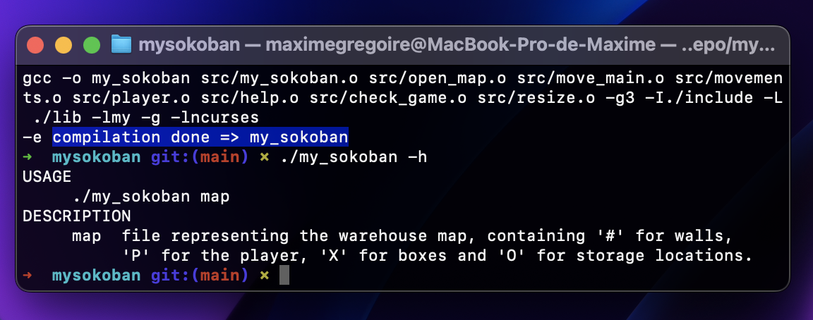
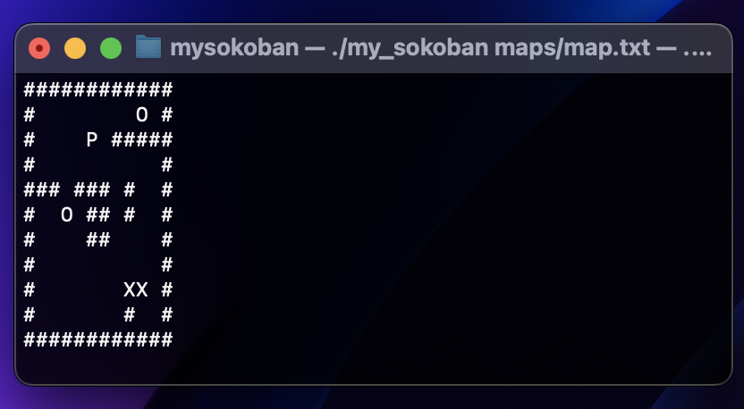
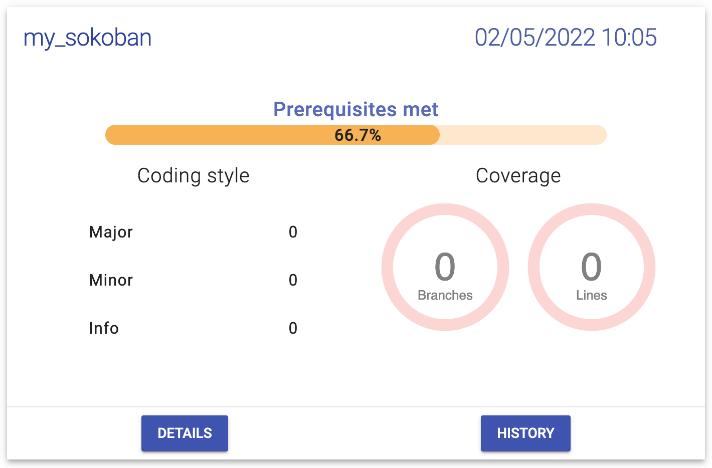

# MY_SOKOBAN
**`1st year project with NCurses library`**
{EPITECH} The goal of this project is to develop a copy of Sokoban game in terminal mode, using the ncurses library.

## REQUIREMENTS

* [GCC](https://gcc.gnu.org/)
* [Make](https://www.gnu.org/software/make/)
* [NCURSES](https://fr.wikipedia.org/wiki/Ncurses) (for the bonus)

## HOW TO USE
Compilation

```
$>  make
```
Execution

```
$>  ./my_sokoban maps/map1
```

Help

```
$>  ./my_sokoban -h
```


### Game
* Use arrows to move ```P```.
* Press ```SPACE BAR``` to reset.
* Put the ```X``` (boxes) on the ```O``` (storage locations).
* If all the boxes are on the storage locations, you win.
* If none of the boxes can be moved anymore, you lose.
## Map example


## Coverage

